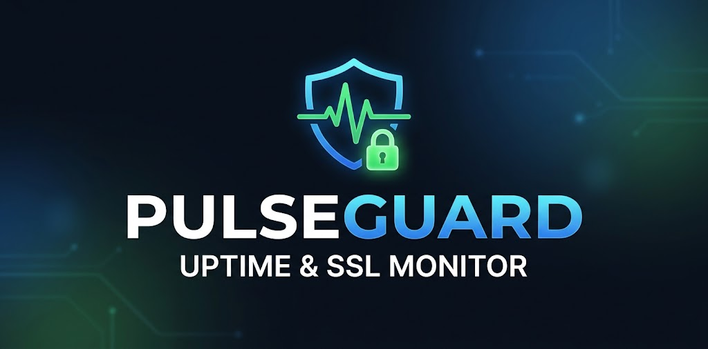

<div align="center">

# 🛡️ PulseGuard 
**Uptime, SSL & Infrastructure Monitoring System**


<br>


> *Micro-serviciu asincron complet pentru monitorizarea disponibilității web, a certificatelor SSL și a telemetriei hardware, integrat nativ cu livrare continuă (CI/CD) și acces Zero-Trust.*



</div>

---

## ⚙️ Arhitectură & Tehnologii

* **Backend & Servicii:** Python 3.12, FastAPI, SQLAlchemy (`asyncpg`), Telegram Bot API.
* **Bază de date:** PostgreSQL 15 (containerizat cu persistență pe volum Docker dedicat).
* **Frontend:** Interfață web responsivă cu Tailwind CSS și vizualizare date via Chart.js.
* **Observabilitate:** Prometheus (colectare metrici time-series), Node Exporter (hardware), Grafana (dashboard-uri).
* **Rețea & Securitate:** 
  * Nginx nativ (Reverse Proxy pe portul 80, Virtual Hosting, rutare `/etc/hosts`).
  * Tailscale Mesh VPN (WireGuard) pentru acces SSH Zero-Trust de la distanță.
  * UFW (Firewall) pentru izolarea strictă a serviciilor.
* **CI/CD & Automatizare:** GitHub Actions cu **Self-Hosted Runner** (via agent local `deployer`), configurat ca serviciu `systemd` pentru deploy automat.

---

## 🏗️ Diagramă Arhitecturală

```text
                  [ Dispozitive Remote / Cafenea ]
                                 │
                     Tailscale Mesh Network (WireGuard)
                                 │
┌── VAIO Server (Ubuntu LTS) ────▼────────────────────────────────────────────┐
│                                                                             │
│                            Nginx (Native Host Proxy)                        │
│                           Port 80 (Virtual Hosting)                         │
│                                │             │                              │
│         ┌──────────────────────┘             └──────────────────────┐       │
│         ▼                                                           ▼       │
│  app.pulseguard.local / IP                               grafana.pulseguard.local
│         │                                                           │       │
│         ▼                                                           ▼       │
│  FastAPI Backend (:8000)                                     Grafana (:3000)│
│    ├── Async Checker Worker                                         ▲       │
│    ├── Telegram Bot Alerts                                          │       │
│    └── PostgreSQL Database (:5432)                           Prometheus (:9090)
│                                                                     ▲       │
│                                                                     │       │
│                                                            Node Exporter (:9100)
│                                                                             │
│  CI/CD: GitHub Actions Self-Hosted Runner (User: deployer)                  │
└─────────────────────────────────────────────────────────────────────────────┘

🚀 Funcționalități Cheie

    🟢 Monitorizare activă: Ping HTTP asincron al endpoint-urilor la intervale configurate.

    🔒 Tracking SSL: Verificare automată a validității și expirării certificatelor TLS/SSL.

    📲 Alerte Telegram: Notificări instantanee la downtime, restabilire conexiune sau expirare certificat.

    📈 Telemetrie Hardware: Monitorizare resurse (CPU, RAM, rețea, disc I/O) agregate în timp real în Grafana.

    🔄 GitOps CI/CD: Execuția comenzii git push origin main declanșează automat sincronizarea codului și rebuild-ul containerelor în producție.

🧠 Provocări Tehnice Rezolvate

    Optimizare WebSocket & Proxy: Am integrat Nginx ca punct unic de intrare pentru multiple subdomenii, rezolvând protocolul WebSockets (esențial pentru interfața Grafana) prin injecția directă a headerelor Upgrade și Connection.

    Acces Zero-Trust: Eliminarea riscurilor de securitate asociate cu expunerea porturilor pe internet (Port Forwarding) prin implementarea unei arhitecturi mesh VPN (Tailscale).

    Securitate CI/CD (Non-Root Runner): Am izolat procesul automatizat de livrare sub un cont Linux restricționat, acordând acces granular la socketul Docker (/var/run/docker.sock) fără a periclita integritatea sistemului gazdă.

    Izolarea Datelor: Baza de date relațională comunică exclusiv prin rețeaua internă bridge a Docker, izolată complet de conexiuni externe direct din firewall.

🔮 Perspective de Scalare (Roadmap)

    Kubernetes (k3s) Orchestration: Transformarea specificațiilor docker-compose în manifestări declarative K8s (Pods, Deployments, StatefulSets) și integrarea unui Traefik Ingress Controller.

    Alertmanager & Reguli Proactive: Integrare nativă în stack-ul Prometheus pentru a declanșa webhook-uri la creșterea consumului de memorie RAM pe nodul principal.

    Arhitectură Distribuită: Separarea task-urilor de ping în agenți satelit (minions) aflați în regiuni cloud diferite, pentru verificări multi-datacenter fără fals-pozitive locale.
